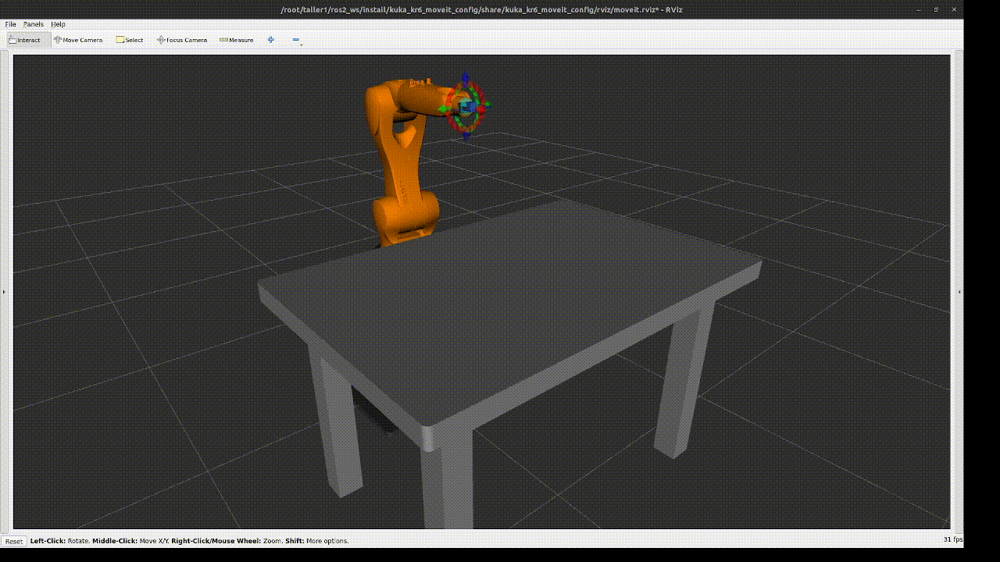

<div align="center">

# 🤖 Avances Preliminares de Taller de Grado I  
## Simulación de Pick and Place con KUKA KR6 R900 en ROS2 Humble usando MoveIt2


</div>

> Proyecto preliminar para la visualización, planificación y simulación de una secuencia tipo pick and place con un robot KUKA KR6 R900, utilizando ROS2 Humble, MoveIt2, RViz2 y Docker.

> [!IMPORTANT]
> Este avance es una simulación preliminar. No realiza todavía comunicación TCP/IP con el robot físico ni control real del gripper.

---

## 🎥 Evidencia visual: secuencia Pick and Place

<p align="center">
  
</p>

<p align="center">
  <em>Secuencia preliminar de pick and place simulada en RViz2 utilizando MoveIt2.</em>
</p>

---

## 📌 Descripción del proyecto

Este repositorio corresponde a los avances preliminares de Taller de Grado I, enfocados en el desarrollo de una simulación para el manipulador industrial KUKA KR6 R900. El entorno se basa en ROS2 Humble, MoveIt2, RViz2 y Docker para asegurar la portabilidad y la replicabilidad del proyecto sin necesidad de instalar ROS2 directamente en el sistema host.

El enfoque actual es enteramente simulado. El objetivo principal es visualizar el robot, cargar la escena del entorno de laboratorio, planificar trayectorias libres de colisión y preparar la ejecución de una secuencia tipo *pick and place* (tomar y dejar). La conexión física TCP/IP con el controlador real del robot KUKA queda planteada para una etapa posterior del desarrollo.

Actualmente, el sistema permite mover el robot a través de una interfaz gráfica para guardar posiciones articulares de manera interactiva, conformando una secuencia, para luego validar su planificación de trayectoria y, opcionalmente, simular la ejecución de los movimientos usando MoveIt2.

---

## ✅ Alcance actual

Actualmente el proyecto permite:
- Visualizar el KUKA KR6 R900 en RViz2.
- Cargar la escena del laboratorio, incluyendo modelos de base, mesa, gripper, cubo y otros elementos ya configurados.
- Usar MoveIt2 con el grupo de planificación definido como `manipulator`.
- Planificar trayectorias avanzadas usando OMPL/RRTConnect.
- Visualizar de forma previsualizada las trayectorias planificadas en RViz2.
- Mover el robot visualmente mediante `joint_state_publisher_gui` para posicionarlo y establecer puntos clave.
- Guardar puntos articulares (joint states) mediante la invocación del servicio `/save_pick_place_point`.
- Almacenar automáticamente la secuencia completa en un archivo YAML.
- Validar la planificación cinemática de la secuencia tipo *pick and place*.
- Ejecutar la secuencia planificada si existe un controlador simulado activo o un *fake hardware*.

> [!NOTE]
> - Por ahora no se controla el cierre ni la apertura real del gripper de la herramienta.
> - El cubo no se adjunta físicamente al gripper durante la toma; es solo simulación de movimiento articular.
> - El *pick and place* actual se restringe a una simulación de movimiento por puntos predefinidos.
> - La ejecución real asume que el controlador `joint_trajectory_controller` se encuentra activo en el ecosistema ROS2.

---

## 🧱 Arquitectura del sistema

Para poder levantar y usar el entorno se requiere:
- **SO:** Linux.
- **Contenedores:** Docker instalado.
- **Permisos:** Permisos de administrador o inclusión del usuario en el grupo para ejecutar Docker.
- **Gráficos:** Servidor gráfico X11 disponible y configurado en el host.
- **Control de versiones:** Git instalado.
- **Red:** Conexión a internet estable (solo necesaria para la primera construcción de la imagen de Docker).

> [!TIP]
> No es necesario tener instalado ROS2 de forma nativa en el host, ya que todo el stack de ROS2 se ejecuta directamente desde dentro del contenedor Docker.

---

## 📁 Estructura del repositorio

La estructura de las carpetas es la siguiente:

```text
Taller1/
├── docker/                 # Archivos de configuración para Docker (Dockerfile, scripts)
│   └── Dockerfile
├── scripts/                # Scripts de automatización para creación y acceso al contenedor
├── ros2_ws/                # Espacio de trabajo (Workspace) principal de ROS2
│   └── src/
│       ├── kuka_kr6_support/           # Modelos y geometría del robot y el laboratorio
│       ├── kuka_resources/             # Recursos compartidos y materiales
│       ├── kuka_kr6_moveit_config/     # Configuración de MoveIt2 y SRDF
│       ├── kuka_pick_place_interfaces/ # Definición de servicios personalizados (interfaces CMake)
│       └── kuka_pick_place_demo/       # Nodos Python para lógica de secuencia y grabación
└── README.md
```

---

## 📦 Paquetes ROS2

A continuación se resume la función de los paquetes desarrollados:

| Paquete | Tipo | Función |
|---|---|---|
| `kuka_kr6_support` | description | Modelo URDF/XACRO, mallas y configuración del KUKA |
| `kuka_resources` | resources | Recursos compartidos requeridos por el modelo |
| `kuka_kr6_moveit_config` | MoveIt2 config | Planificación con grupo manipulator y OMPL/RRTConnect |
| `kuka_pick_place_interfaces` | interfaces | Servicio SavePoint para guardar puntos |
| `kuka_pick_place_demo` | Python nodes | Grabación y ejecución de secuencia pick and place |

### 🚀 Resumen de Launch Files

| Launch | Paquete | Uso |
|---|---|---|
| `display.launch.py` | kuka_kr6_support | Visualización básica del robot |
| `demo.launch.py` | kuka_kr6_moveit_config | MoveIt2, RViz2, GUI o fake hardware |
| `point_recorder.launch.py` | kuka_pick_place_demo | Guardar puntos desde /joint_states |
| `pick_place_sequence.launch.py` | kuka_pick_place_demo | Validar o ejecutar secuencia YAML |

---

## 🐳 Configuración con Docker

Dado que instalar todo el sistema de ROS2 y MoveIt2 desde cero en cada computadora es ineficiente y problemático, el uso de Docker permite encapsular y replicar el ambiente operativo.

### Primer uso
La primera vez que uses el proyecto, debes compilar la imagen base y luego levantar tu contenedor:

```bash
cd ~/Documents/taller1
chmod +x scripts/*.sh
./scripts/build_image.sh
./scripts/create_container.sh
```

---

## 🚀 Uso diario

El flujo normal para iniciar tu trabajo con el robot cada día. 

> [!WARNING]
> **SIEMPRE** debes permitir que el contenedor Docker retransmita datos gráficos hacia la interfaz X11 de la máquina host antes de iniciar el contenedor.

```bash
cd ~/Documents/taller1
xhost +local:docker
docker start kuka_ros2_humble_container
docker attach kuka_ros2_humble_container
```

* Para salir del attach y volver al host **sin apagar el contenedor**, utiliza la combinación de teclado: `Ctrl + P`, luego `Ctrl + Q`.
* Si estando atachado escribes el comando `exit`, el contenedor principal se detendrá.

---

## 🖥️ Abrir segunda terminal

Si tienes el attach corriendo en una consola y necesitas lanzar nodos en paralelo, **no utilices** `docker attach` de nuevo, o la nueva consola simplemente clonará visualmente lo que hace la primera. 

Abre una nueva terminal en el host y ejecuta:

```bash
docker exec -it kuka_ros2_humble_container bash
```

Una vez dentro de este nuevo shell:

```bash
cd /root/taller1/ros2_ws
source /opt/ros/humble/setup.bash
source install/setup.bash
```

---

## 🛠️ Compilación

Siempre que modifiques lógica de nodos, archivos XACRO, o CMake, debes compilar el entorno desde el interior del contenedor.

```bash
cd /root/taller1/ros2_ws
source /opt/ros/humble/setup.bash
colcon build --symlink-install
source install/setup.bash
```

La bandera `--symlink-install` evita que debas recompilar si sólo modificaste un archivo de Python, YAML, o Launch script.

---

## 🤖 MoveIt2 y planificación

La integración central con MoveIt2 se ejecuta a través de su launch principal.

### Visualización con GUI para setear puntos
**Es el modo correcto y recomendado para inspeccionar visualmente la celda robótica y guardar puntos iniciales.**

```bash
ros2 launch kuka_kr6_moveit_config demo.launch.py use_gui:=true use_rviz:=true
```

### Modo con fake hardware para ejecución
**Es el modo correcto para usar en simultáneo con `execute:=true` en rutinas secuenciales.** Desactiva el panel GUI que traba los ejes articulares.

```bash
ros2 launch kuka_kr6_moveit_config demo.launch.py use_fake_hardware:=true use_gui:=false use_rviz:=true
```

---

## 🎮 Seteo visual de puntos

### Caso A: crear nuevos puntos desde cero
Si necesitas capturar posiciones específicas, limpia el almacenamiento:

```bash
cp ros2_ws/src/kuka_pick_place_demo/config/pick_place_points.yaml ros2_ws/src/kuka_pick_place_demo/config/pick_place_points.backup.yaml
```

Abre `ros2_ws/src/kuka_pick_place_demo/config/pick_place_points.yaml` y déjalo vacío:
```yaml
sequence: []
```

### Paso 1: Lanzar MoveIt2 con GUI
En tu **Terminal 1**:
```bash
ros2 launch kuka_kr6_moveit_config demo.launch.py use_gui:=true use_rviz:=true
```

### Paso 2: Lanzar grabador de puntos
En tu **Terminal 2**:
```bash
ros2 launch kuka_pick_place_demo point_recorder.launch.py
```

---

## 💾 Guardado de puntos

Abre una **Terminal 3**, y realiza secuencialmente las grabaciones. Recuerda que **antes de lanzar cada comando**, debes ajustar los sliders en la GUI a la pose deseada para ese evento.

```bash
# 1. Ajustar sliders a postura base inicial
ros2 service call /save_pick_place_point kuka_pick_place_interfaces/srv/SavePoint "{name: 'home', overwrite: true}"

# 2. Ajustar sliders encima del objeto objetivo
ros2 service call /save_pick_place_point kuka_pick_place_interfaces/srv/SavePoint "{name: 'approach_pick', overwrite: true}"

# 3. Ajustar sliders bajando a tomar el objeto
ros2 service call /save_pick_place_point kuka_pick_place_interfaces/srv/SavePoint "{name: 'pick', overwrite: true}"

# 4. Ajustar sliders subiendo con el objeto
ros2 service call /save_pick_place_point kuka_pick_place_interfaces/srv/SavePoint "{name: 'lift', overwrite: true}"

# 5. Ajustar sliders hacia la zona de destino superior
ros2 service call /save_pick_place_point kuka_pick_place_interfaces/srv/SavePoint "{name: 'approach_place', overwrite: true}"

# 6. Ajustar sliders al momento de soltar
ros2 service call /save_pick_place_point kuka_pick_place_interfaces/srv/SavePoint "{name: 'place', overwrite: true}"

# 7. Ajustar sliders alejándose (retirada segura)
ros2 service call /save_pick_place_point kuka_pick_place_interfaces/srv/SavePoint "{name: 'retreat', overwrite: true}"
```

---

## 🔁 Secuencia Pick and Place

### Validar planificación de la secuencia
Con MoveIt2 y GUI corriendo en **Terminal 1**, lanza la validación en **Terminal 3**:
```bash
ros2 launch kuka_pick_place_demo pick_place_sequence.launch.py execute:=false
```
Este proceso procesa el array de YAML iterativamente contra el API de `move_action`. Evaluará factibilidades trigonométricas y previsualizará la ruta.

### Ejecutar secuencia
Cierra todos los nodos y consolas GUI usando `Ctrl + C`. El robot requiere ahora que soltemos el candado del GUI.

Vuelve a levantar la base bajo *fake_hardware* sin forzar la UI (**Terminal 1**):
```bash
ros2 launch kuka_kr6_moveit_config demo.launch.py use_fake_hardware:=true use_gui:=false use_rviz:=true
```

Ejecuta la secuencia (**Terminal 2**):
```bash
ros2 launch kuka_pick_place_demo pick_place_sequence.launch.py execute:=true use_fake_controller:=true
```

---

## 📡 Tópicos, acciones y servicios

### Tópicos clave
| Tópico | Uso principal |
|---|---|
| `/joint_states` | Posición instantánea articular del robot (rad). |
| `/tf` y `/tf_static` | Árbol de transformaciones cinemáticas relativas. |
| `/robot_description` | URDF/XACRO serializado a string. |
| `/display_planned_path` | Publica la previsualización del camino planificado en RViz2. |

### Acciones base
| Acción | Finalidad |
|---|---|
| `/move_action` | Action server global manejado por `move_group`. |
| `/execute_trajectory` | Acción subyacente delegada. |
| `/joint_trajectory_controller/follow_joint_trajectory` | Interfaz con el controlador físico/simulado. |

### Servicios personalizados
| Servicio | Funcionalidad |
|---|---|
| `/save_pick_place_point` | Invocación asíncrona para congelar el `/joint_states` actual a YAML. |

**Comandos de verificación útiles:**
```bash
ros2 topic list
ros2 action list
ros2 service list
ros2 node list
ros2 control list_controllers
```

---

## 🧪 Validación

Es importante comprender la terminología subyacente que opera nuestro nodo:
- **Plan:** Únicamente evalúa las matemáticas OMPL/RRT y proyecta hologramas mediante `/display_planned_path`.
- **Execute:** MoveIt2 recibe un flujo paramétrico ya procesado y busca un ActionServer vinculado para enviarle los valores. Si no hay Controlador, falla abruptamente.
- **Plan & Execute:** Coordina lógicamente un *Plan* exitoso y automáticamente empuja la cascada de *Execute*.

---

## ⚠️ Problemas comunes

| Problema | Causa probable | Solución rápida |
|---|---|---|
| **RViz2 no abre de inmediato** | Falta de variables gráficas delegadas. | Escribir `xhost +local:docker` en la terminal base host. |
| **Terminal visualiza output duplicado** | Se usó `docker attach` simultáneo. | Usa `docker exec -it` para abrir nuevos threads limpios. |
| **No aparece geometría del robot** | Errores TF `Fixed Frame`. | Ajusta `Fixed Frame` a `base_link` y revisa advertencias. |
| **Falla sistemática de Plan** | Posición inicial en colisión. | Modificar punto `home` o revisar el entorno. |
| **Falla inmediata de Execute** | Falta de Action activas. | Ejecutar con `use_fake_controller:=true`. |
| **YAML estancado** | Permisos del archivo. | Verifica escritura del archivo o usa `chmod`. |
| **En modo GUI robot retrocede** | El slider estático sobre-escribe. | El GUI nunca debe usarse en ejecuciones de rutas. |

---

## 🧭 Próximos pasos

La siguiente etapa de escalamiento de la simulación hacia la implementación real contemplará:
- Consolidar los puentes entre *fake hardware* / `ros2_control` y MoveIt2.
- Realizar microajustes de métricas precisas a los 7 puntos de pick and place.
- Integrar la dinámica algorítmica y visual para comandar el cierre y apertura paramétrico del *gripper*.
- Adjuntar y desadjuntar el cubo como *collision object* acoplado al *end effector*.
- Depurar las mediciones de tiempos precisos de planificación vs ejecución.
- Evaluar formalmente el enlace TCP/IP al gabinete del controlador de producción real del sistema físico.
