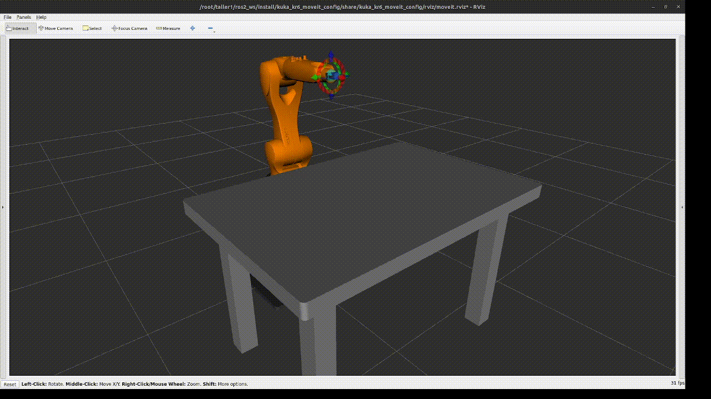

<div align="center">

# 🤖 Avances Preliminares de Taller de Grado I  
## Simulación de Pick and Place con KUKA KR6 R900 en ROS2 Humble usando MoveIt2


</div>

> Proyecto preliminar para la visualización, planificación y simulación de una secuencia tipo pick and place con un robot KUKA KR6 R900, utilizando ROS2 Humble, MoveIt2, RViz2 y Docker.

> [!IMPORTANT]
> Este avance es una simulación preliminar. No realiza todavía comunicación TCP/IP con el robot físico ni control real del gripper.

---

## 🎥 Evidencia visual: secuencia Pick and Place

<p align="center">
  
</p>

<p align="center">
  <em>Secuencia preliminar de pick and place simulada en RViz2 utilizando MoveIt2.</em>
</p>

---

## 📌 Descripción del proyecto

Este repositorio corresponde a los avances preliminares de Taller de Grado I, enfocados en el desarrollo de una simulación para el manipulador industrial KUKA KR6 R900. El entorno se basa en ROS2 Humble, MoveIt2, RViz2 y Docker para asegurar la portabilidad y la replicabilidad del proyecto sin necesidad de instalar ROS2 directamente en el sistema host.

El enfoque actual es enteramente simulado. El objetivo principal es visualizar el robot, cargar la escena del entorno de laboratorio, planificar trayectorias libres de colisión y preparar la ejecución de una secuencia tipo *pick and place* (tomar y dejar). La conexión física TCP/IP con el controlador real del robot KUKA queda planteada para una etapa posterior del desarrollo.

Actualmente, el sistema permite mover el robot a través de una interfaz gráfica para guardar posiciones articulares de manera interactiva, conformando una secuencia, para luego validar su planificación de trayectoria y, opcionalmente, simular la ejecución de los movimientos usando MoveIt2.

---

## ✅ Alcance actual

Actualmente el proyecto permite:
- Visualizar el KUKA KR6 R900 en RViz2.
- Cargar la escena del laboratorio, incluyendo modelos de base, mesa, gripper, cubo y otros elementos ya configurados.
- Usar MoveIt2 con el grupo de planificación definido como `manipulator`.
- Planificar trayectorias avanzadas usando OMPL/RRTConnect.
- Visualizar de forma previsualizada las trayectorias planificadas en RViz2.
- Mover el robot visualmente mediante `joint_state_publisher_gui` para posicionarlo y establecer puntos clave.
- Guardar puntos articulares (joint states) mediante la invocación del servicio `/save_pick_place_point`.
- Almacenar automáticamente la secuencia completa en un archivo YAML.
- Validar la planificación cinemática de la secuencia tipo *pick and place*.
- Ejecutar la secuencia planificada si existe un controlador simulado activo o un *fake hardware*.
- Recibir desde una GUI externa una lista de configuraciones articulares reales (en grados) y **generar con MoveIt2 una trayectoria independiente por cada transición** `P1→P2`, `P2→P3`, … devolviéndolas en JSON.
- **Previsualizar en RViz2** una secuencia ya guardada, sin mover el robot real
  (requiere añadir una vez el display *RobotState*: ver
  [Configuración obligatoria de RViz](#configuración-obligatoria-de-rviz-para-probar-trayectoria)).

> [!NOTE]
> - Por ahora no se controla el cierre ni la apertura real del gripper de la herramienta.
> - El cubo no se adjunta físicamente al gripper durante la toma; es solo simulación de movimiento articular.
> - El *pick and place* actual se restringe a una simulación de movimiento por puntos predefinidos.
> - La ejecución real asume que el controlador `joint_trajectory_controller` se encuentra activo en el ecosistema ROS2.

---

## 🧱 Arquitectura del sistema

Para poder levantar y usar el entorno se requiere:
- **SO:** Linux.
- **Contenedores:** Docker instalado.
- **Permisos:** Permisos de administrador o inclusión del usuario en el grupo para ejecutar Docker.
- **Gráficos:** Servidor gráfico X11 disponible y configurado en el host.
- **Control de versiones:** Git instalado.
- **Red:** Conexión a internet estable (solo necesaria para la primera construcción de la imagen de Docker).

> [!TIP]
> No es necesario tener instalado ROS2 de forma nativa en el host, ya que todo el stack de ROS2 se ejecuta directamente desde dentro del contenedor Docker.

---

## 📁 Estructura del repositorio

La estructura de las carpetas es la siguiente:

```text
Taller1/
├── docker/                 # Archivos de configuración para Docker (Dockerfile, scripts)
│   └── Dockerfile
├── scripts/                # Scripts de automatización para creación y acceso al contenedor
├── ros2_ws/                # Espacio de trabajo (Workspace) principal de ROS2
│   └── src/
│       ├── kuka_kr6_support/           # Modelos y geometría del robot y el laboratorio
│       ├── kuka_resources/             # Recursos compartidos y materiales
│       ├── kuka_kr6_moveit_config/     # Configuración de MoveIt2 y SRDF
│       ├── kuka_pick_place_interfaces/ # Definición de servicios personalizados (interfaces CMake)
│       ├── kuka_pick_place_demo/       # Nodos Python para lógica de secuencia y grabación
│       ├── kuka_gui_moveit_bridge/     # Puente GUI externa ↔ MoveIt2 (comandos en vivo, grados)
│       ├── kuka_trajectory_logger/     # Registrador pasivo de trayectorias MoveIt2 a CSV
│       └── kuka_moveit_trajectory_planner/ # Generación por segmentos + preview RViz (JSON)
└── README.md
```

---

## 📦 Paquetes ROS2

A continuación se resume la función de los paquetes desarrollados:

| Paquete | Tipo | Función |
|---|---|---|
| `kuka_kr6_support` | description | Modelo URDF/XACRO, mallas y configuración del KUKA |
| `kuka_resources` | resources | Recursos compartidos requeridos por el modelo |
| `kuka_kr6_moveit_config` | MoveIt2 config | Planificación con grupo manipulator y OMPL/RRTConnect |
| `kuka_pick_place_interfaces` | interfaces | Servicio SavePoint para guardar puntos |
| `kuka_pick_place_demo` | Python nodes | Grabación y ejecución de secuencia pick and place |
| `kuka_gui_moveit_bridge` | Python nodes | Puente entre una GUI externa y MoveIt2 (comandos articulares y cartesianos en grados) |
| `kuka_trajectory_logger` | Python nodes | Observador pasivo que guarda en CSV las trayectorias de `/display_planned_path` |
| `kuka_moveit_trajectory_planner` | Python nodes | **Genera** trayectorias MoveIt2 por segmentos desde JSON y las **previsualiza** en RViz2 |

### 🚀 Resumen de Launch Files

| Launch | Paquete | Uso |
|---|---|---|
| `display.launch.py` | kuka_kr6_support | Visualización básica del robot |
| `demo.launch.py` | kuka_kr6_moveit_config | MoveIt2, RViz2, GUI o fake hardware. Acepta `tool:=gripper\|marker` |
| `point_recorder.launch.py` | kuka_pick_place_demo | Guardar puntos desde /joint_states |
| `pick_place_sequence.launch.py` | kuka_pick_place_demo | Validar o ejecutar secuencia YAML |
| `kuka_bridge_system.launch.py` | kuka_gui_moveit_bridge | MoveIt2 + RViz2 + controlador simulado + puente para la GUI. Acepta `tool:=gripper\|marker` |
| `trajectory_logger.launch.py` | kuka_trajectory_logger | Registrar en CSV las trayectorias planificadas |
| `trajectory_planner.launch.py` | kuka_moveit_trajectory_planner | Generación por segmentos y previsualización (adicional y opcional) |

---

## 🐳 Configuración con Docker

Dado que instalar todo el sistema de ROS2 y MoveIt2 desde cero en cada computadora es ineficiente y problemático, el uso de Docker permite encapsular y replicar el ambiente operativo.

### Primer uso
La primera vez que uses el proyecto, debes compilar la imagen base y luego levantar tu contenedor:

```bash
cd ~/Documents/taller1
chmod +x scripts/*.sh
./scripts/build_image.sh
./scripts/create_container.sh
```

---

## 🚀 Uso diario

El flujo normal para iniciar tu trabajo con el robot cada día. 

> [!WARNING]
> **SIEMPRE** debes permitir que el contenedor Docker retransmita datos gráficos hacia la interfaz X11 de la máquina host antes de iniciar el contenedor.

```bash
cd ~/Documents/taller1
xhost +local:docker
docker start kuka_ros2_humble_container
docker attach kuka_ros2_humble_container
```

* Para salir del attach y volver al host **sin apagar el contenedor**, utiliza la combinación de teclado: `Ctrl + P`, luego `Ctrl + Q`.
* Si estando atachado escribes el comando `exit`, el contenedor principal se detendrá.

---

## 🖥️ Abrir segunda terminal

Si tienes el attach corriendo en una consola y necesitas lanzar nodos en paralelo, **no utilices** `docker attach` de nuevo, o la nueva consola simplemente clonará visualmente lo que hace la primera. 

Abre una nueva terminal en el host y ejecuta:

```bash
docker exec -it kuka_ros2_humble_container bash
```

Una vez dentro de este nuevo shell:

```bash
cd /root/taller1/ros2_ws
source /opt/ros/humble/setup.bash
source install/setup.bash
```

---

## 🌐 Variables de entorno DDS

Antes de lanzar cualquier nodo, exporta estas dos variables **en cada terminal ROS2** del contenedor (tanto en la del `attach` como en las abiertas con `docker exec`):

```bash
export FASTDDS_BUILTIN_TRANSPORTS=UDPv4
export ROS_LOCALHOST_ONLY=0
```

* `FASTDDS_BUILTIN_TRANSPORTS=UDPv4`: obliga a Fast DDS a comunicarse únicamente por UDPv4, desactivando el transporte de memoria compartida. Evita los bloqueos y descubrimientos incompletos que se producen entre el contenedor y el host cuando se usa memoria compartida.
* `ROS_LOCALHOST_ONLY=0`: no restringe el tráfico ROS2 a `localhost`, de modo que los nodos son visibles fuera de la máquina. Es necesario para la comunicación con el entorno externo del robot real.

> [!TIP]
> Para no repetirlos en cada terminal, añádelos al `~/.bashrc` dentro del contenedor:
> ```bash
> echo 'export FASTDDS_BUILTIN_TRANSPORTS=UDPv4' >> ~/.bashrc
> echo 'export ROS_LOCALHOST_ONLY=0' >> ~/.bashrc
> ```

---

## 🛠️ Compilación

Siempre que modifiques lógica de nodos, archivos XACRO, o CMake, debes compilar el entorno desde el interior del contenedor.

```bash
cd /root/taller1/ros2_ws
source /opt/ros/humble/setup.bash
colcon build --symlink-install
source install/setup.bash
```

La bandera `--symlink-install` evita que debas recompilar si sólo modificaste un archivo de Python, YAML, o Launch script.

Para compilar **un solo paquete** (por ejemplo tras añadir
`kuka_moveit_trajectory_planner`, que no obliga a recompilar ningún otro):

```bash
cd /root/taller1/ros2_ws
source /opt/ros/humble/setup.bash
colcon build --symlink-install --packages-select kuka_moveit_trajectory_planner
source install/setup.bash
```

---

## 🤖 MoveIt2 y planificación

La integración central con MoveIt2 se ejecuta a través de su launch principal.

### Visualización con GUI para setear puntos
**Es el modo correcto y recomendado para inspeccionar visualmente la celda robótica y guardar puntos iniciales.**

```bash
ros2 launch kuka_kr6_moveit_config demo.launch.py use_gui:=true use_rviz:=true
```

### Modo con fake hardware para ejecución
**Es el modo correcto para usar en simultáneo con `execute:=true` en rutinas secuenciales.** Desactiva el panel GUI que traba los ejes articulares.

```bash
ros2 launch kuka_kr6_moveit_config demo.launch.py use_fake_hardware:=true use_gui:=false use_rviz:=true
```

---

## 🔧 Selección de herramienta (gripper / marker)

El argumento `tool` elige **qué herramienta se representa en el flange**. Es el mismo
launch de siempre: sólo cambia la geometría dibujada y su volumen de colisión.

| Argumento | Valores | Por defecto |
|---|---|---|
| `tool` | `gripper` \| `marker` | `gripper` |

```bash
# Sistema completo (bridge + MoveIt2 + RViz2) — comportamiento de siempre: GRIPPER
ros2 launch kuka_gui_moveit_bridge kuka_bridge_system.launch.py

# Gripper explícito
ros2 launch kuka_gui_moveit_bridge kuka_bridge_system.launch.py tool:=gripper

# Marcador
ros2 launch kuka_gui_moveit_bridge kuka_bridge_system.launch.py tool:=marker
```

El mismo argumento existe en el launch de MoveIt2, por si lo levantas suelto:

```bash
ros2 launch kuka_kr6_moveit_config demo.launch.py use_gui:=true use_rviz:=true tool:=marker
```

### Qué cambia y qué no

| Con `tool:=gripper` | Con `tool:=marker` |
|---|---|
| Visual + collision del **gripper** | Visual + collision del **marcador** |
| Cubo azul visible | Cubo azul oculto |

La selección es **mutuamente excluyente**: nunca aparecen gripper y marcador a la vez.

> [!IMPORTANT]
> Cambiar de herramienta **no altera la cinemática**. `X Y Z A B C`, el TCP, el
> `flange`, los frames TF, los joints y toda la cadena cinemática son idénticos con
> los dos valores: las dos ramas comparten el mismo `gripper_env_link` y el mismo
> `gripper_env_joint`. Lo único que cambia es la malla dibujada dentro de ese frame
> y el volumen que MoveIt2 usa para detectar colisiones.

La selección está implementada en `kuka_kr6_support/urdf/environment.xacro` mediante
`<xacro:arg name="tool" default="gripper"/>` y dos bloques `<xacro:if>` dentro del
link de la herramienta. Las mallas viven en
`kuka_kr6_support/meshes/environment/` (`gripper.stl`, `marker.stl`).

> [!WARNING]
> Tras añadir o cambiar una malla de herramienta hay que **recompilar** el workspace
> (`colcon build --symlink-install`), porque los STL se instalan como enlaces creados
> en tiempo de compilación y un archivo nuevo todavía no tiene el suyo.

---

## 🔌 Nodos para la GUI externa (generación y previsualización por JSON)

Los dos nodos que hablan con la **GUI externa** (`kuka_gui_control`) por los cuatro
tópicos JSON del contrato **no se levantan solos**: `trajectory_planner.launch.py`
arranca **únicamente** sus dos nodos, sin MoveIt2 ni RViz2. Hay que lanzarlo
**además** del sistema, en una segunda terminal.

**Terminal 1 — MoveIt2 y RViz2** (cualquiera de las dos opciones):

```bash
ros2 launch kuka_kr6_moveit_config demo.launch.py use_gui:=false use_rviz:=true
```

```bash
ros2 launch kuka_gui_moveit_bridge kuka_bridge_system.launch.py
```

**Terminal 2 — los nodos del contrato JSON:**

```bash
ros2 launch kuka_moveit_trajectory_planner trajectory_planner.launch.py
```

Arranca `kuka_trajectory_generator_node` (genera) y `kuka_trajectory_preview_node`
(previsualiza). Ambos son **adicionales y opcionales**: se pueden iniciar y detener
en cualquier momento sin afectar a MoveIt2, a RViz2 ni al bridge.

**Comprobar que están escuchando:**

```bash
ros2 topic info /kuka_moveit/trajectory_generation/request_json -v
```

Debe indicar `Subscription count: 1`. Los cuatro tópicos del contrato son:

| Tópico | Sentido |
|---|---|
| `/kuka_moveit/trajectory_generation/request_json` | GUI → generador |
| `/kuka_moveit/trajectory_generation/result_json` | generador → GUI |
| `/kuka_moveit/trajectory_preview/request_json` | GUI → previsualización |
| `/kuka_moveit/trajectory_preview/status_json` | previsualización → GUI |

Con eso, desde la GUI externa: **ENVIAR TRAYECTORIA** genera y **PROBAR TRAYECTORIA**
previsualiza en RViz2.

> [!IMPORTANT]
> Este flujo usa la configuración **afinada** de MoveIt2 (`kuka_kr6_moveit_config`).
> No es la condición base del estudio comparativo, que vive en el paquete
> independiente `kuka_kr6_moveit_baseline` y no expone tópicos JSON.

> [!NOTE]
> El argumento `tool` se aplica en la **terminal 1**, que es la que carga el modelo.
> `trajectory_planner.launch.py` no lo necesita: no carga `robot_description`.

---

## 🎮 Seteo visual de puntos

### Caso A: crear nuevos puntos desde cero
Si necesitas capturar posiciones específicas, limpia el almacenamiento:

```bash
cp ros2_ws/src/kuka_pick_place_demo/config/pick_place_points.yaml ros2_ws/src/kuka_pick_place_demo/config/pick_place_points.backup.yaml
```

Abre `ros2_ws/src/kuka_pick_place_demo/config/pick_place_points.yaml` y déjalo vacío:
```yaml
sequence: []
```

### Paso 1: Lanzar MoveIt2 con GUI
En tu **Terminal 1**:
```bash
ros2 launch kuka_kr6_moveit_config demo.launch.py use_gui:=true use_rviz:=true
```

### Paso 2: Lanzar grabador de puntos
En tu **Terminal 2**:
```bash
ros2 launch kuka_pick_place_demo point_recorder.launch.py
```

---

## 💾 Guardado de puntos

Abre una **Terminal 3**, y realiza secuencialmente las grabaciones. Recuerda que **antes de lanzar cada comando**, debes ajustar los sliders en la GUI a la pose deseada para ese evento.

```bash
# 1. Ajustar sliders a postura base inicial
ros2 service call /save_pick_place_point kuka_pick_place_interfaces/srv/SavePoint "{name: 'home', overwrite: true}"

# 2. Ajustar sliders encima del objeto objetivo
ros2 service call /save_pick_place_point kuka_pick_place_interfaces/srv/SavePoint "{name: 'approach_pick', overwrite: true}"

# 3. Ajustar sliders bajando a tomar el objeto
ros2 service call /save_pick_place_point kuka_pick_place_interfaces/srv/SavePoint "{name: 'pick', overwrite: true}"

# 4. Ajustar sliders subiendo con el objeto
ros2 service call /save_pick_place_point kuka_pick_place_interfaces/srv/SavePoint "{name: 'lift', overwrite: true}"

# 5. Ajustar sliders hacia la zona de destino superior
ros2 service call /save_pick_place_point kuka_pick_place_interfaces/srv/SavePoint "{name: 'approach_place', overwrite: true}"

# 6. Ajustar sliders al momento de soltar
ros2 service call /save_pick_place_point kuka_pick_place_interfaces/srv/SavePoint "{name: 'place', overwrite: true}"

# 7. Ajustar sliders alejándose (retirada segura)
ros2 service call /save_pick_place_point kuka_pick_place_interfaces/srv/SavePoint "{name: 'retreat', overwrite: true}"
```

---

## 🔁 Secuencia Pick and Place

### Validar planificación de la secuencia
Con MoveIt2 y GUI corriendo en **Terminal 1**, lanza la validación en **Terminal 3**:
```bash
ros2 launch kuka_pick_place_demo pick_place_sequence.launch.py execute:=false
```
Este proceso procesa el array de YAML iterativamente contra el API de `move_action`. Evaluará factibilidades trigonométricas y previsualizará la ruta.

### Ejecutar secuencia
Cierra todos los nodos y consolas GUI usando `Ctrl + C`. El robot requiere ahora que soltemos el candado del GUI.

Vuelve a levantar la base bajo *fake_hardware* sin forzar la UI (**Terminal 1**):
```bash
ros2 launch kuka_kr6_moveit_config demo.launch.py use_fake_hardware:=true use_gui:=false use_rviz:=true
```

Ejecuta la secuencia (**Terminal 2**):
```bash
ros2 launch kuka_pick_place_demo pick_place_sequence.launch.py execute:=true use_fake_controller:=true
```

---

## 🧩 Generación, guardado y previsualización de trayectorias (GUI externa)

El paquete `kuka_moveit_trajectory_planner` conecta este entorno con el **otro
entorno** (`TG2`: las GUIs y la comunicación TCP/IP con el KUKA real).

> [!IMPORTANT]
> Este contenedor **solo genera y previsualiza**.
> - **No ejecuta** trayectorias (`plan_only` siempre `true`, sin parámetro para desactivarlo).
> - **No controla el robot real** ni publica en `/kuka_bridge/*`, `/joint_states`
>   o `/fake_joint_states`. No usa EnableMove, TCP/IP, EKI, SPS ni KRL.
> - **No guarda el archivo final**: publica el resultado y **el archivo se guarda
>   en el otro entorno**, donde están las GUIs y el TCP/IP.

### Flujo completo: SET → ENVIAR PUNTOS → GUARDAR → PROBAR EN RVIZ

```text
GUI externa (TG2)
   │  SET  ×N   (captura AxisActual del KUKA real)
   ▼
P1, P2, ... PN                      grados, sin mover el robot
   │  ENVIAR PUNTOS
   ▼
/kuka_moveit/trajectory_generation/request_json        std_msgs/String + JSON
   ▼
kuka_moveit_trajectory_planner  (kuka_trajectory_generator_node)
   │   grados → radianes, start_state explícito, plan_only = true
   ▼
MoveIt2  /move_action → move_group   (OMPL/RRTConnect ya configurado)
   ▼
/kuka_moveit/trajectory_generation/result_json         T1..T(N-1)
   ▼
GUI
   │  GUARDAR
   ▼
trajectory_sequence_YYYYMMDD_HHMMSS.json               (se guarda en TG2)
   │  PROBAR TRAYECTORIA
   ▼
/kuka_moveit/trajectory_preview/request_json
   ▼
kuka_trajectory_preview_node
   ▼
/kuka_moveit/trajectory_preview/robot_state            DisplayRobotState
   ▼
RViz2 → display RobotState                             ← hay que añadirlo a mano
```

### Ruta física, claramente separada: ENVIAR TRAYECTORIA

```text
GUI externa (TG2)
   │  ENVIAR TRAYECTORIA
   ▼
puntos de la trayectoria
   ▼
bridge TCP/IP existente
   ▼
KUKA real
   ▼
feedback AxisActual
   ▼
ROS  →  /joint_states
   ▼
RViz2 → display RobotModel
```

> [!WARNING]
> **`PROBAR TRAYECTORIA` NO mueve el KUKA físico.** Solo dibuja en RViz2.
> Mover el robot es responsabilidad exclusiva de `ENVIAR TRAYECTORIA`, que
> viaja por el bridge TCP/IP del otro entorno y no pasa por este paquete.

### Botones de la GUI

| Botón | Qué hace | ¿Mueve el robot? |
|---|---|---|
| **SET** | Captura la posición articular actual del feedback real del KUKA (`AxisActual`) y crea `P1`, `P2`, … `PN`. No escribe en disco todavía. | No |
| **ENVIAR PUNTOS** | Publica `P1..PN` en `request_json`; MoveIt2 genera `T1 = P1→P2`, `T2 = P2→P3`, … devolviendo **todos** los puntos intermedios de cada `JointTrajectory`. | No |
| **GUARDAR** | Escribe el resultado en `/home/eduardex/Documents/TG2/trajectories/trajectory_sequence_YYYYMMDD_HHMMSS.json`. | No |
| **PROBAR TRAYECTORIA** | Reproduce la trayectoria **solo en RViz2**. | No |
| **ENVIAR TRAYECTORIA** | **Ejecución física** por el bridge TCP/IP. | **Sí** |

> [!CAUTION]
> El archivo **nunca** debe guardarse dentro de `install/`: ese directorio lo
> regenera `colcon build` y las trayectorias se perderían. La ruta correcta es
> `/home/eduardex/Documents/TG2/trajectories`.

### Cómo se forman los segmentos

Cada transición entre puntos consecutivos es un **segmento independiente**:

```text
T1 = P1 → P2      T2 = P2 → P3      T3 = P3 → P4   ...   T(N-1) = P(N-1) → PN
```

Los segmentos **no se unen** en una trayectoria nueva optimizada, no se
re-muestrean, no se simplifican y no se suavizan: se guarda **exactamente** la
trayectoria base que produce MoveIt2 hoy. El final de un segmento se usa como
inicio del siguiente, de modo que la secuencia es continua.

Se conservan todos los puntos intermedios, `time_from_start`, `positions`, y las
`velocities`/`accelerations` **solo si MoveIt2 las entrega** (si no, se
devuelven listas vacías: nunca se inventa un cero). Las posiciones se guardan en
radianes (dato original) y también convertidas a grados.

### Contrato ROS 2 (JSON sobre `std_msgs/msg/String`)

| Tópico | Dirección | Contenido |
|---|---|---|
| `/kuka_moveit/trajectory_generation/request_json` | GUI → contenedor | `points` con `joints_deg`, eventos de garra y `planner` |
| `/kuka_moveit/trajectory_generation/result_json` | contenedor → GUI | `segments` con sus `trajectory_points`, o el error |
| `/kuka_moveit/trajectory_preview/request_json` | GUI → contenedor | La secuencia guardada que se quiere ver |
| `/kuka_moveit/trajectory_preview/status_json` | contenedor → GUI | `playing`, `completed`, `cancelled` o `error` |

QoS de los cuatro: `RELIABLE`, `KEEP_LAST`, profundidad `10`. No se modifica la
configuración DDS existente. Los tópicos de **visualización** que usa el preview
están en la tabla de [Tópicos, acciones y servicios](#-tópicos-acciones-y-servicios).

#### Contrato envuelto del preview

La GUI publica la petición de `PROBAR TRAYECTORIA` **envuelta**:

```jsonc
{
  "schema_version": 1,
  "preview_id": "...",
  "request_id": "...",
  "source_file": "/home/eduardex/Documents/TG2/trajectories/trajectory_sequence_....json",
  "trajectory": {                 // ← joint_names y segments viven AQUÍ dentro
    "joint_names": [ ... ],
    "segments": [ ... ]
  }
}
```

`segments` **está dentro de `trajectory`**, no en el nivel raíz. El parser
también acepta el **formato directo** (`{"joint_names": [...], "segments": [...]}`)
por compatibilidad con archivos anteriores.

### Formato del archivo `trajectory_sequence_*.json`

Estructura resumida (el archivo real trae los 123 puntos completos):

```jsonc
{
  "schema_version": 1,
  "request_id": "...",
  "status": "ok",
  "joint_names": ["joint_a1", "joint_a2", "joint_a3",
                  "joint_a4", "joint_a5", "joint_a6"],
  "source_points": [
    { "id": "P1", "joints_deg": [ ... ], "joints_rad": [ ... ] }
  ],
  "gripper": { "initial_state": "open", "events": [] },
  "planner_metadata": { "group": "manipulator", "plan_only": true, ... },
  "segments": [
    {
      "segment_id": "T1",
      "from": "P1",
      "to": "P2",
      "duration_sec": 1.234,
      "point_count": 16,
      "trajectory_points": [
        {
          "index": 0,
          "time_from_start_sec": 0.0,
          "positions_rad": [ ... ],
          "positions_deg": [ ... ],
          "velocities_rad_s": [ ... ],
          "accelerations_rad_s2": [ ... ]
        }
      ]
    }
  ],
  "summary": {
    "source_point_count": 9,
    "segment_count": 8,
    "trajectory_point_count": 123
  }
}
```

Formato completo, campo por campo:
[`README.md` del paquete](ros2_ws/src/kuka_moveit_trajectory_planner/README.md).

### Eventos de garra

La garra se considera **inicialmente ABIERTA** (`initial_state: "open"`). Los
eventos (`{"at_point": "P2", "action": "close"}`) **no afectan al cálculo de
MoveIt2**: se conservan íntegros y se devuelven en el resultado para que el otro
entorno los almacene y los ejecute después junto al punto correspondiente.

### Manejo de errores

Si un segmento falla, la generación **se detiene**: se devuelve
`status: "error"` con `failed_segment`, `from_point`, `to_point`, el mensaje y
el código de MoveIt2. **Nunca** se devuelve `"ok"` con la secuencia incompleta,
y la GUI **no debe considerarla ejecutable**.

### Configuración obligatoria de RViz para PROBAR TRAYECTORIA

> [!IMPORTANT]
> **Sin este paso `PROBAR TRAYECTORIA` no se ve, aunque todo lo demás funcione.**
> El nodo publica correctamente, pero si RViz no está suscrito no dibuja nada.

RViz **no** trae por defecto ningún display escuchando el tópico de preview. Hay
que añadirlo **una vez** en la sesión de RViz:

```text
Displays → Add → moveit_rviz_plugin → RobotState
```

y configurarlo exactamente así:

| Campo | Valor |
|---|---|
| **Robot Description** | `robot_description` |
| **Robot State Topic** | `/kuka_moveit/trajectory_preview/robot_state` |
| **Robot Root Link** | `world` |

Verificación:

```bash
ros2 topic info /kuka_moveit/trajectory_preview/robot_state -v
```

| Salida | Significado |
|---|---|
| `Publisher count: 1` / `Subscription count: 1` | ✅ RViz está escuchando el preview. |
| `Publisher count: 1` / `Subscription count: 0` | ❌ El nodo publica pero **RViz no está suscrito**: falta el display *RobotState* o tiene mal el tópico. |

> [!TIP]
> Guarda la configuración de RViz (`File → Save Config As…`) en un archivo
> propio para no repetir este paso cada vez. **No sobrescribas**
> `kuka_kr6_moveit_config/rviz/moveit.rviz`: ese archivo es del sistema actual y
> este paquete no lo modifica.

### Reproducción continua en el preview

Los segmentos guardados conservan **siempre** su forma original `T1 … TN`, pero
para dibujar, el nodo construye **en runtime** una única secuencia continua:

- `T1` reproduce **todos** sus puntos;
- para `T2..TN` se omite **solo el primer punto** si coincide con el final del
  segmento anterior (`Ti[-1] == T(i+1)[0]`);
- el tiempo se traslada a un **reloj global** que nunca vuelve a cero;
- **no** se recalculan posiciones, **no** se tocan velocidades ni aceleraciones,
  **no** se interpolan puntos nuevos y **no** se modifica el archivo guardado.

Caso real validado:

| Concepto | Valor |
|---|---|
| Segmentos originales | 8 (`T1..T8`) |
| Puntos originales en el archivo | **123** (siguen almacenados) |
| Fronteras duplicadas | 7 |
| Poses dibujadas en el preview | **116** (`123 − 7`) |

Parámetros actuales del nodo de preview:

| Parámetro | Valor | Significado |
|---|---|---|
| `boundary_tolerance_rad` | `1e-6` | Tolerancia para dar por duplicada la pose de una frontera. |
| `inter_segment_gap_sec` | `0.0` | Hueco en el reloj global, solo entre fronteras **no** duplicadas. `0.0` = continuo. |

> [!NOTE]
> Los parámetros `display_mode` e `inter_segment_pause_sec` **ya no existen**.
> Eran los que hacían que RViz reiniciase la animación y que el robot se
> detuviera medio segundo en cada frontera.

### Estado real del robot ≠ preview

Son **dos caminos independientes** y no deben mezclarse:

```text
ESTADO REAL (existente, intacto)          PREVIEW (nuevo, solo visual)
──────────────────────────────            ────────────────────────────
KUKA                                      trayectoria MoveIt2
  ↓ TCP/IP / EKI                            ↓
AxisActual                                kuka_trajectory_preview_node
  ↓                                         ↓
ROS                                       DisplayRobotState
  ↓                                         ↓
/joint_states                             /kuka_moveit/trajectory_preview/robot_state
  ↓                                         ↓
RViz → display RobotModel                 RViz → display RobotState
```

El preview **no publica** posiciones simuladas como si fueran feedback real: no
escribe en `/joint_states` ni en ningún tópico del bridge. De hecho, el nodo
**se niega a arrancar** si se le configura un tópico cuyo nombre contenga
`kuka_bridge`, `joint_command`, `joint_states`, `follow_joint_trajectory`,
`execute_trajectory`, `move_action`, `controller` o `enable_move`.

### `MAX_DELTA` del KRL: no confundir con la trayectoria completa

El KRL mantiene actualmente `MAX_DELTA = 10°` **por junta**. Eso **no** significa
que una trayectoria completa solo pueda recorrer 10°: el límite se aplica al
cambio entre **dos comandos consecutivos** enviados al controlador, y MoveIt2
genera puntos intermedios densos.

Máximos medidos entre puntos consecutivos en la trayectoria de prueba:

| Junta | Δ máximo | Límite |
|---|---|---|
| A1 | ≈ 3.55° | 10° |
| A2 | ≈ 3.00° | 10° |
| A3 | ≈ 1.42° | 10° |
| A4 | ≈ 0.03° | 10° |
| A5 | ≈ 3.88° | 10° |
| A6 | ≈ 1.69° | 10° |

Todos por debajo de 10°, así que **no hizo falta aumentar `MAX_DELTA`**. Este
valor se documenta aquí como referencia; **no se modifica** desde este entorno.

### Puesta en marcha

Antes de nada, exporta las variables DDS en **cada** terminal ROS2 del
contenedor (ver [Variables de entorno DDS](#-variables-de-entorno-dds)):

```bash
export FASTDDS_BUILTIN_TRANSPORTS=UDPv4
export ROS_LOCALHOST_ONLY=0
```

Compilar **solo** este paquete (dentro del contenedor):

```bash
cd /root/taller1/ros2_ws
source /opt/ros/humble/setup.bash

colcon build --symlink-install --packages-select kuka_moveit_trajectory_planner

source install/setup.bash
```

Levantar el sistema:

```bash
# Terminal 1 — el sistema de siempre (sin cambios)
ros2 launch kuka_kr6_moveit_config demo.launch.py use_gui:=false use_rviz:=true

# Terminal 2 — generación + previsualización (launch adicional y opcional)
ros2 launch kuka_moveit_trajectory_planner trajectory_planner.launch.py

# Solo el preview, cuando la generación no hace falta
ros2 launch kuka_moveit_trajectory_planner trajectory_planner.launch.py use_generator:=false
```

Y después, **en RViz**, añade el display *RobotState* como se indica en
[Configuración obligatoria de RViz](#configuración-obligatoria-de-rviz-para-probar-trayectoria).

### Diagnóstico rápido

```bash
# ¿Están los dos nodos vivos?
ros2 node list | grep -E "trajectory|preview"
#   /kuka_trajectory_generator_node
#   /kuka_trajectory_preview_node

# ¿RViz está escuchando el preview? (Subscription count debe ser 1)
ros2 topic info /kuka_moveit/trajectory_preview/robot_state -v

# ¿Llega la petición de PROBAR TRAYECTORIA?
ros2 topic echo /kuka_moveit/trajectory_preview/request_json

# ¿Qué responde el preview? (playing → completed)
ros2 topic echo /kuka_moveit/trajectory_preview/status_json

# ¿A qué ritmo se están dibujando las poses?
ros2 topic hz /kuka_moveit/trajectory_preview/robot_state
```

### Estado validado actualmente

| Etapa | Estado |
|---|---|
| SET de puntos | ✅ OK |
| Generación MoveIt2 | ✅ OK |
| 8 segmentos | ✅ OK |
| 123 puntos | ✅ OK |
| Guardado JSON | ✅ OK |
| Carga de trayectoria | ✅ OK |
| Request de preview | ✅ OK |
| Parser del preview | ✅ OK |
| Reproducción continua | ✅ OK |
| RobotState en RViz | ✅ OK |
| `MAX_DELTA` 10° | Compatible con los puntos generados |
| **Ejecución física de esta trayectoria** | ⏳ **Pendiente de probar** |

> [!NOTE]
> Lo validado hasta ahora es **generación, guardado y previsualización**. La
> ejecución física completa de esta trayectoria por el bridge TCP/IP todavía no
> se ha probado.

Documentación completa del contrato, del formato JSON y de los parámetros:
[`ros2_ws/src/kuka_moveit_trajectory_planner/README.md`](ros2_ws/src/kuka_moveit_trajectory_planner/README.md).

---

## 📡 Tópicos, acciones y servicios

### Tópicos clave
| Tópico | Uso principal |
|---|---|
| `/joint_states` | Posición instantánea articular del robot (rad). |
| `/tf` y `/tf_static` | Árbol de transformaciones cinemáticas relativas. |
| `/robot_description` | URDF/XACRO serializado a string. |
| `/display_planned_path` | `moveit_msgs/msg/DisplayTrajectory`. **Tópico compartido con `move_group`**: publica ahí cada plan resuelto. El preview también lo usa para dibujar el camino completo de una vez, pero **no es** el tópico principal de `PROBAR TRAYECTORIA` (ver la fila siguiente). |
| `/kuka_moveit/trajectory_preview/robot_state` | `moveit_msgs/msg/DisplayRobotState`. **Tópico principal de `PROBAR TRAYECTORIA`**: reproducción punto a punto de la trayectoria generada, exclusivamente para visualización en RViz2. Requiere añadir el display *RobotState* (ver [configuración obligatoria](#configuración-obligatoria-de-rviz-para-probar-trayectoria)). |
| `/kuka_moveit/trajectory_generation/request_json` | `std_msgs/msg/String` (JSON). GUI → contenedor: secuencia `P1..PN` en grados. |
| `/kuka_moveit/trajectory_generation/result_json` | `std_msgs/msg/String` (JSON). Contenedor → GUI: segmentos `T1..T(N-1)` generados por MoveIt2. |
| `/kuka_moveit/trajectory_preview/request_json` | `std_msgs/msg/String` (JSON). GUI → contenedor: secuencia guardada que se quiere previsualizar (`segments` dentro de `trajectory`). |
| `/kuka_moveit/trajectory_preview/status_json` | `std_msgs/msg/String` (JSON). Contenedor → GUI: `playing` / `completed` / `cancelled` / `error`. |

### Acciones base
| Acción | Finalidad |
|---|---|
| `/move_action` | Action server global manejado por `move_group`. |
| `/execute_trajectory` | Acción subyacente delegada. |
| `/joint_trajectory_controller/follow_joint_trajectory` | Interfaz con el controlador físico/simulado. |

### Servicios personalizados
| Servicio | Funcionalidad |
|---|---|
| `/save_pick_place_point` | Invocación asíncrona para congelar el `/joint_states` actual a YAML. |

**Comandos de verificación útiles:**
```bash
ros2 topic list
ros2 action list
ros2 service list
ros2 node list
ros2 control list_controllers

# Preview: ¿RViz está suscrito? (Subscription count debe ser 1)
ros2 topic info /kuka_moveit/trajectory_preview/robot_state -v
```

---

## 🧪 Validación

Es importante comprender la terminología subyacente que opera nuestro nodo:
- **Plan:** Únicamente evalúa las matemáticas OMPL/RRT y proyecta hologramas mediante `/display_planned_path`.
- **Execute:** MoveIt2 recibe un flujo paramétrico ya procesado y busca un ActionServer vinculado para enviarle los valores. Si no hay Controlador, falla abruptamente.
- **Plan & Execute:** Coordina lógicamente un *Plan* exitoso y automáticamente empuja la cascada de *Execute*.

---

## ⚠️ Problemas comunes

| Problema | Causa probable | Solución rápida |
|---|---|---|
| **RViz2 no abre de inmediato** | Falta de variables gráficas delegadas. | Escribir `xhost +local:docker` en la terminal base host. |
| **Terminal visualiza output duplicado** | Se usó `docker attach` simultáneo. | Usa `docker exec -it` para abrir nuevos threads limpios. |
| **No aparece geometría del robot** | Errores TF `Fixed Frame`. | Ajusta `Fixed Frame` a `base_link` y revisa advertencias. |
| **Falla sistemática de Plan** | Posición inicial en colisión. | Modificar punto `home` o revisar el entorno. |
| **Falla inmediata de Execute** | Falta de Action activas. | Ejecutar con `use_fake_controller:=true`. |
| **YAML estancado** | Permisos del archivo. | Verifica escritura del archivo o usa `chmod`. |
| **En modo GUI robot retrocede** | El slider estático sobre-escribe. | El GUI nunca debe usarse en ejecuciones de rutas. |
| **`PROBAR TRAYECTORIA` no se ve en RViz** | RViz no está suscrito a `/kuka_moveit/trajectory_preview/robot_state` (`Subscription count: 0`). El nodo publica bien, pero nadie escucha. | Añadir el display *RobotState* con `Robot State Topic` = ese tópico y `Robot Root Link` = `world`. Ver [configuración obligatoria](#configuración-obligatoria-de-rviz-para-probar-trayectoria). |
| **El robot "parpadea" o se reinicia entre puntos** | El preview publicaba un `DisplayTrajectory` por segmento (RViz reiniciaba la animación), repetía la pose duplicada de cada frontera y reiniciaba el reloj en cada `Ti`. | Corregido: reproducción continua con reloj global y sin la pose duplicada. Si persiste, revisar que RViz tenga el display *RobotState* configurado. |
| **`segments debe ser una lista no vacia`** | La GUI envía la trayectoria **envuelta** en `"trajectory"` y el parser la buscaba en el nivel raíz. | Corregido: el parser lee `joint_names` y `segments` desde `payload["trajectory"]`, y admite el formato directo. Verificar el JSON con `ros2 topic echo /kuka_moveit/trajectory_preview/request_json`. |
| **Se pierden las trayectorias guardadas** | Se guardaron dentro de `install/`, que `colcon build` regenera. | Guardar en `/home/eduardex/Documents/TG2/trajectories`. |
| **`El action server /move_action no esta disponible`** | El launch del planner se arrancó sin `move_group` corriendo. | Levantar primero `demo.launch.py` (o `kuka_bridge_system.launch.py`) y comprobar las variables DDS. |

---

## 🧭 Próximos pasos

La siguiente etapa de escalamiento de la simulación hacia la implementación real contemplará:
- Consolidar los puentes entre *fake hardware* / `ros2_control` y MoveIt2.
- Realizar microajustes de métricas precisas a los 7 puntos de pick and place.
- Integrar la dinámica algorítmica y visual para comandar el cierre y apertura paramétrico del *gripper*.
- Adjuntar y desadjuntar el cubo como *collision object* acoplado al *end effector*.
- Depurar las mediciones de tiempos precisos de planificación vs ejecución.
- Evaluar formalmente el enlace TCP/IP al gabinete del controlador de producción real del sistema físico.
- Validar la **ejecución física** (`ENVIAR TRAYECTORIA`) de una secuencia ya generada, guardada y previsualizada: hoy solo están validadas la generación, el guardado y el preview.
